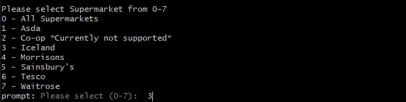
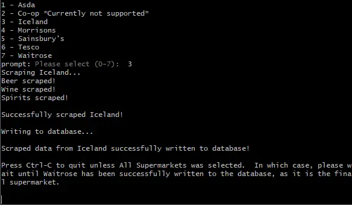

## Table of Contents <!-- omit in toc -->

- [What is the point of this web scraper?](#what-is-the-point-of-this-web-scraper)
- [Supermarkets Currently Supported](#supermarkets-currently-supported)
- [Technologies Used](#technologies-used)
- [Run Locally](#run-locally)
- [So how do I use it?](#so-how-do-i-use-it)
- [Authors](#authors)

## What is the point of this web scraper?

The Ubooze Supermarket Scraper Utility is a custom made Node.js web scraper for UK supermarket alcohol prices, with PostgreSQL database integration for insertion and updating of those prices.

This scraper is intended for use with the uBooze web app ([this repository](https://github.com/vitamins999/ubooze)), in order keep the website's database up to date, with the most recent alcohol prices and offers.

It uses Node.js to run in the command line.

## Supermarkets Currently Supported

- Asda
- Iceland
- Morrisons
- Sainsbury's
- Tesco
- Waitrose

## Technologies Used

- Axios
- Puppeteer
- Cheerio
- Knex.js
- Objection.js

## Run Locally

Clone the project

```bash
  git clone https://github.com/vitamins999/ubooze-scraper.git
```

Go to the project directory

```bash
  cd ubooze-scraper
```

Install dependencies

```bash
  npm install
```

Create a `.env` in the root of the project and insert the key/value pair for the PostgreSQL connection in the following format of `KEY=VALUE`

```bash
  DATABASE_URL=your-database-connection
```

Start the program

```bash
  npm start
```

NOTE: This program will not work without a pre-existing database setup using the Knex.js migration tools from the [Ubooze Web App](https://github.com/vitamins999/ubooze). It doesn't create tables. All it does is scrape data and then insert/update that data in a pre-existing database.

## So how do I use it?

It's pretty simple, really.

1. At the prompt, type in the number (_1 - 7_) for the supermarket you want to scrape (or _0_ to scrape all supermarkets).

   

2. Press Ctrl-C to exit the program when instructed, or if _0_ was selected to scrape all supermarkets, press Ctrl-C after the message `Scraped data from Waitrose successfully written to database!` appears (Waitrose is the final supermarket).

   

3. That's it!

## Authors

- [Jools Barnett](https://www.github.com/vitamins999)
